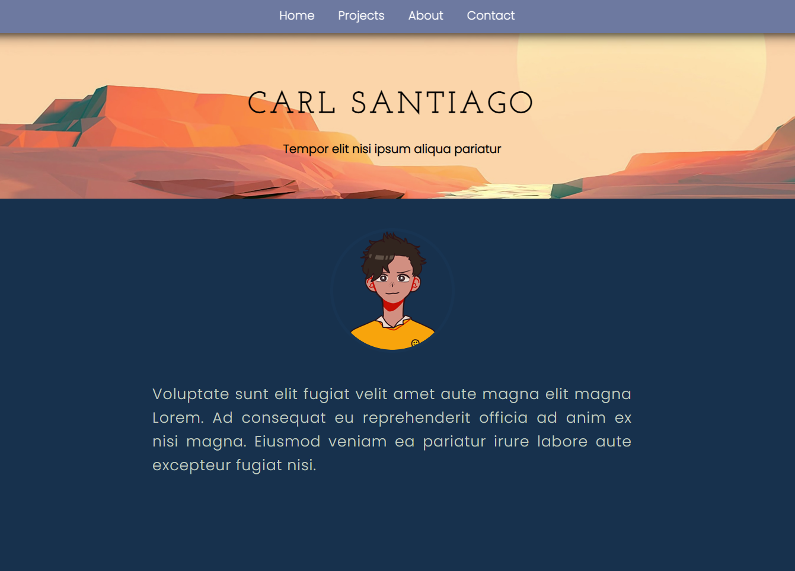
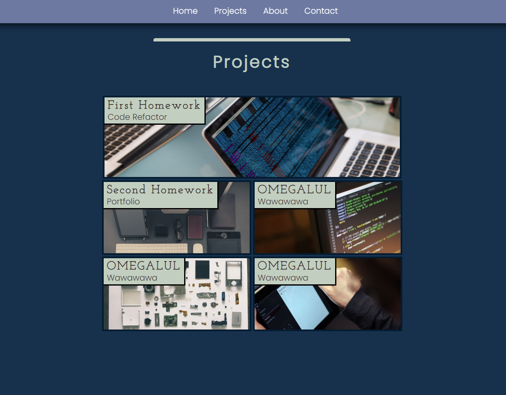
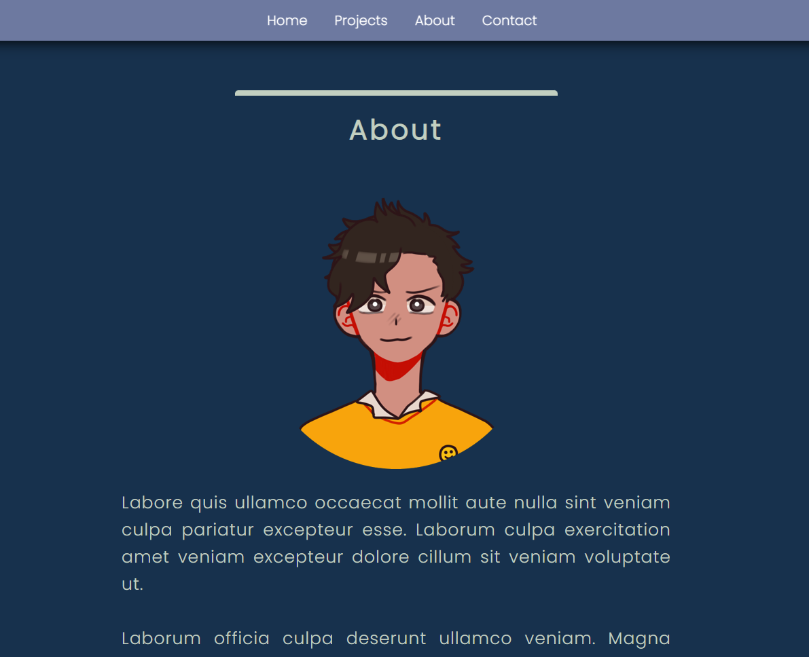
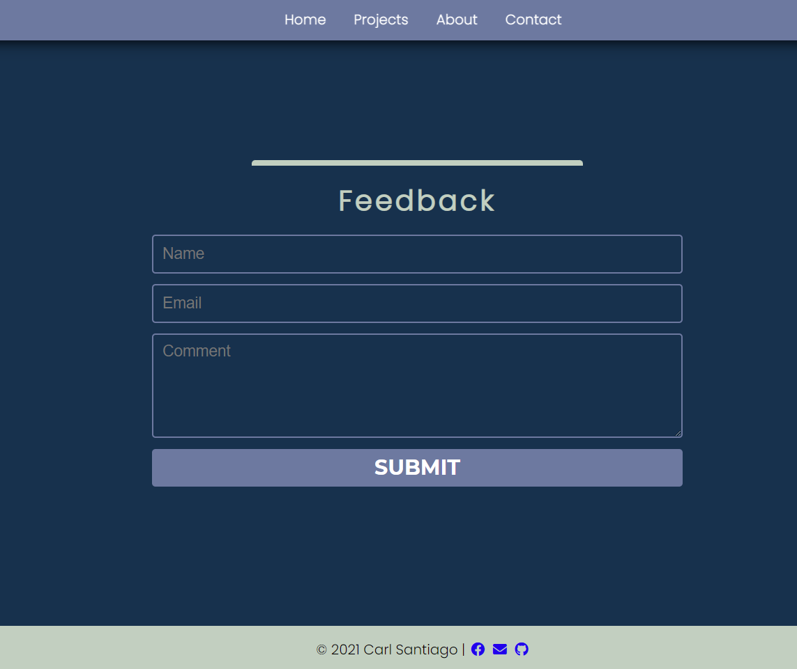

# Homework 2

## Professional Portfolio

Our second homework for this bootcamp. This is to showcase what I've learnt in the first two week of the bootcamp.

## That tasks include

- To create a portfolio of myself using only HTML and CSS.
- To present some sample of my previous works.
- To present my name, photo or avatar, and links to sections of my page.
- To make the links clickable and working properly.
- To have my first sample of work's image larger than the others.
- To have my page responsive.

## Screenshots of sections of my portfolio

### Header

### Projects Samples

### About me

### Contact and Footer

## You can view the final product here

https://carlsantiago.github.io/portfolio/

---

© Carl Santiago\
📧 4518gg@gmail.com
